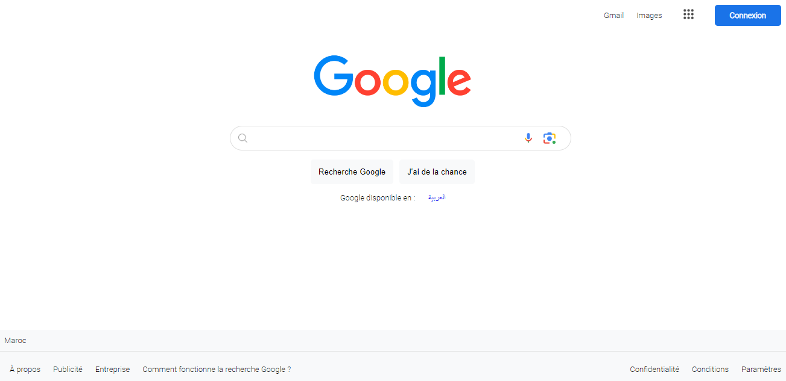

# Projet de Page de Recherche Google en mode non connecté

Ce projet a été développé pour reproduire l'apparence de la page de recherche Google en utilisant HTML et CSS. Il s'agit d'une initiative visant à explorer et à mettre en pratique les compétences de conception et de développement web.

## Fonctionnalités

- Interface utilisateur similaire à la page de recherche Google.
- Développé en utilisant HTML pour la structure et CSS pour la mise en forme.

## Captures d'écran

## Comment utiliser

1. Clonez le dépôt sur votre machine locale.
2. Ouvrez le fichier `index.html` dans un navigateur web pour visualiser la page.

N'hésitez pas à explorer le code source pour mieux comprendre la mise en œuvre.

## Remarques

Ce projet a été réalisé à des fins éducatives et pour pratiquer les concepts de développement web. Il n'est pas affilié à Google et n'est pas destiné à être utilisé à des fins commerciales.

Auteur: Salma Halhoul
